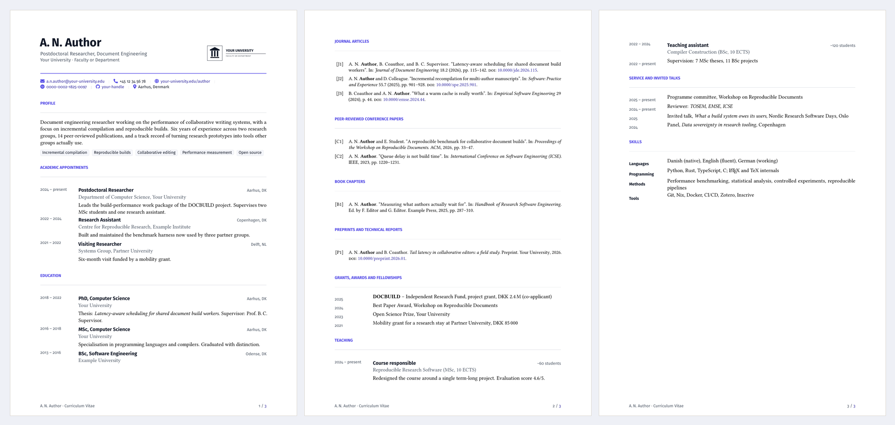

# Academic CV Template

A modern single-column CV for researchers, PhD students and academic
staff. Built for pdfLaTeX, so a rebuild takes about a second and a half.

[](https://app.inscrive.io/docs?snip_uri=https%3A%2F%2Fgithub.com%2Finscrive-io%2Flatex-cv-template%2Farchive%2Frefs%2Fheads%2Fmain.zip&snip_name=Academic%20CV&main_document=main.tex&engine=pdflatex)



Single column is deliberate. It is what hiring and grant committees
expect, it survives being printed, and it never truncates a long
publication list the way a sidebar layout does.

## What you get

- **A header driven by your details.** Name, role, affiliation, email,
  phone, website, ORCID, GitHub and location. Leave any of them empty
  and the item disappears, dividers and all.
- **A placeholder institution logo** at `figures/logo-placeholder.pdf`.
  Any shape works: it is scaled to fit, never stretched.
- **Publications straight from BibTeX.** `\cvpublications{article}{...}`
  prints one numbered group per publication type, newest first.
- **Your own name in bold** in every reference, automatically. Set
  `\cvbibname{Yourname}` once in `main.tex`.
- **Entry macros that keep the layout honest**: `\cventry` for roles
  with a description, `\cvline` for one-line items such as awards and
  talks, `\cvskill` for labelled rows, and `\cvtag` for keyword pills.
- **Page footers** with your name and "page 2 of 3", so a printed copy
  never gets shuffled.
- **Publication numbers you can refer to.** Groups are prefixed, so J1
  is a journal article and C2 a conference paper. "[1]" never means
  three different things.
- **A text layer that machines can read.** The contact icons carry
  `ActualText`, so an applicant tracking system or a screen reader
  receives "Email: you@example.edu" instead of a stray `#`. Copy and
  paste gives you the same.
- **Optional tagged PDF.** Uncomment one line at the top of `main.tex`
  and the output is structurally tagged for screen readers. Tested and
  clean for this template.

## Layout

```
main.tex                 your details and the section order
style/academiccv.sty     all design: colours, fonts, entry macros
sections/
  01-profile.tex
  02-appointments.tex
  03-education.tex
  04-publications.tex    pulls from publications.bib
  05-grants.tex
  06-teaching.tex
  07-service.tex
  08-skills.tex
figures/                 logo placeholder
publications.bib         your publication list
```

## The entry macros

```latex
\cventry{2024 -- present}{Postdoctoral Researcher}
  {Department of Computer Science, Your University}{Aarhus, DK}
  {One or two sentences, or a cvitems list.}

\cvline{2024}{Best Paper Award, Workshop on Reproducible Documents}

\cvskill{Languages}{Danish (native), English (fluent)}

\cvpublications{article}{Journal articles}{J}
```

Any argument may be left empty and that part is skipped.

## Making it yours

1. Replace `figures/logo-placeholder.pdf` with your institution logo, or
   delete the `\cvlogo` line to leave it out entirely.
2. Open `style/academiccv.sty` and change `accent` and `ink` in
   section 1 to your institution's colours.
3. Fill in the details block in `main.tex`, including `\cvbibname`.
4. Replace `publications.bib` with your own. In Inscrive you can keep it
   in sync with Zotero or Mendeley instead of maintaining it by hand.

## Building it locally

```bash
latexmk -pdf main.tex
```

Engine: **pdfLaTeX**. Bibliography: **biber**. Both are the defaults in
Inscrive, so the button above needs no configuration.

## Licence

[MIT](LICENSE). Use it, change it, ship it.
